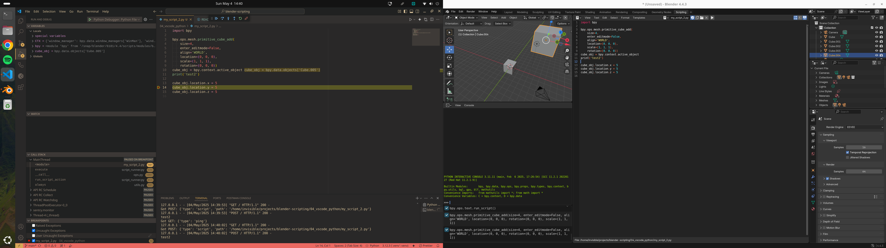
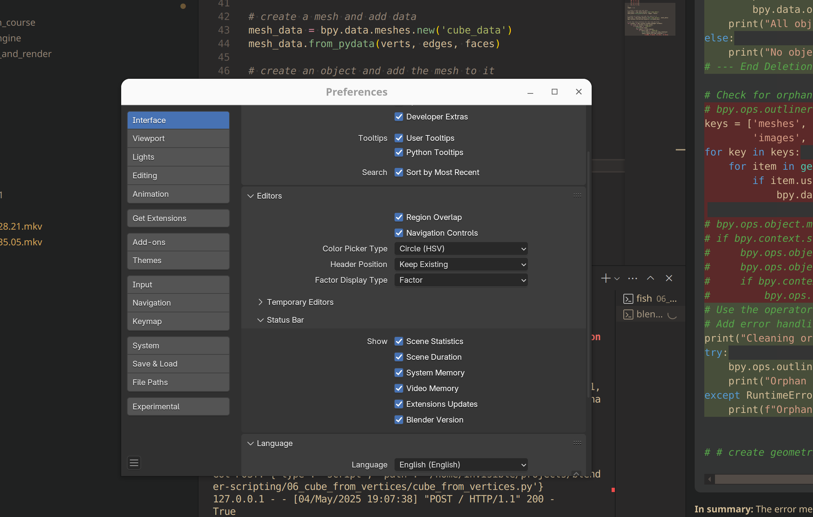
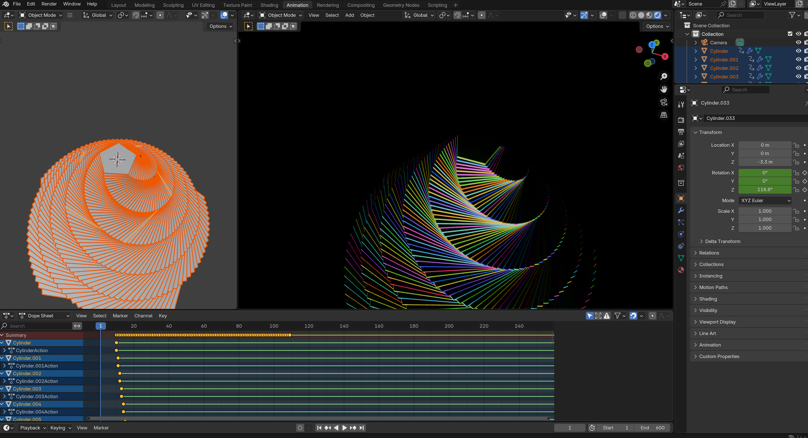

# blender-scripting

Experiments in automating Blender with Python.

## Setup Project for VSCode

```bash
# create a virtual environment
python3 -m venv .venv
source .venv/bin/activate
pip install -r requirements.txt
```

```py
# Now you can get autocompletion for bpy through the fake-bpy-module-latest
import bpy
```

- `Ctrl + Shift + P`: Blender: Start
- `Ctrl + Shift + P`: Blender: Run Script (Not Run & Debug)
- `Alt + R`: Reload active text file
- `Preferences > General > Developer Extras (geometric data)`
- Use `simplescreenrecorder` to record with fast encoding system audio

Note that print statements from the script will appear in the terminal, but not from the python REPL in Blender.

https://marketplace.visualstudio.com/items/?itemName=ms-python.autopep8
https://marketplace.visualstudio.com/items/?itemName=JacquesLucke.blender-development




