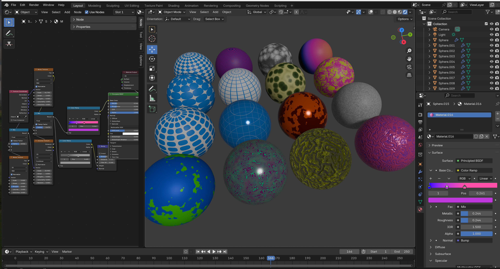
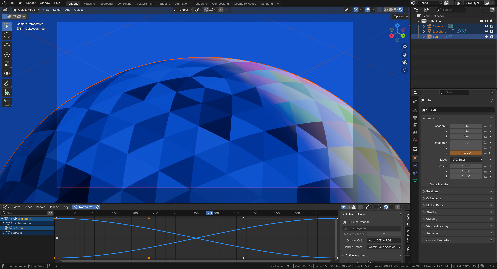

# blender-scripting

Experiments in automating Blender with Python.

## Setup Project for VSCode

```bash
# create a virtual environment
python3 -m venv .venv
source .venv/bin/activate
pip install -r requirements.txt

# Don't have to use the vscode extension, alt workflow:
blender -b -P script.py  # run in background, debug python scripts.
blender -P script.py  # Work in UI
```

```py
# Now you can get autocompletion for bpy through the fake-bpy-module-latest
import bpy
```

## `blender_utils` module

A python module to abstract common blender scripting code.

```sh
blender_utils/
├── starter_script.py  # boilerplate for scripting a blender scene
├── blend_file.py  # work with .blend files
├── scene.py  # clean scenes, work with collections
└── ui.py  # work with the blender ui: get contexts, control viewport
```

## Blender VS Code Extension

There is a deprecated [extension](https://marketplace.visualstudio.com/items/?itemName=JacquesLucke.blender-development), but still works to debug a blender scripts. Crashes frequently.

- `Ctrl + Shift + P`: Blender: Start
- `Ctrl + Shift + P`: Blender: Run Script (Not Run & Debug)

## Blender UI Notes

- `Alt + R`:
- `Preferences > General > Developer Extras (geometric data)`
- Use `simplescreenrecorder` to record with fast encoding system audio

Note that print statements from the script will appear in the terminal, but not from the python REPL in Blender.

## Visual Notes, Renders

|  |
| :--------------------------------------------------------------------------------------------------------: |
|                                      Node Based Material Experiments                                       |

|  |
| :-------------------------------------------------------------------------------------------------------------------------------: |
|                             Using graph editor and camera perspective to proof and tweak an animation                             |

|  |
| :-------------------------------------------------------------------------: |
|                 Mesh from scratch, composing and repetition                 |

|  |
| :-------------------------------------------------------------------------------: |
|                           Procedural Animation Example                            |

|  |
| :---------------------------------------------------------------------------------------------------------------------: |
|                       Status Bar Config - Show Scene Details, Memory, VRAM, Animation data, etc.                        |

|  |
| :--------------------------------------------------: |
|                   Debugger Example                   |
